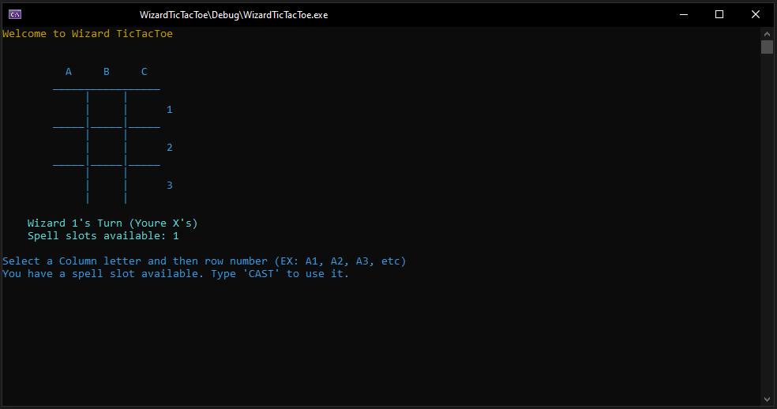

# Wizard TicTacToe

## _Overview_



Wizard TicTacToe is the traditional TicTacToe game with a twist. Two Wizards battle each other by laying down one piece (`X` or `O`) at a time. When a wizard has three pieces in a row (by column, row, or diagonal), the wizard wins.

Once a game, each wizard is able to use their one spell slot to destroy any piece on the board. As collateral, either the column or row (chosen at random) around the piece will burn up in flames. Make sure your input is correct when casting spells. You dont want to mess up your incantation!

### How To Play
1. Starting with Wizard 1, each player will take turns choosing where to place their piece.
2. The wizard will type the square's position starting with the column and then the row.
   - Columns are depicted above and use `A`, `B`, or `C`.
   - Rows are depicted on the right and use `1`, `2`, or `3`.
   - In the end, it should look something like `A1`. Square inputs are not case sensitive, so `a1` is valid as well.
3. After typing the input, press the `ENTER` key to submit the square.
4. If the wizard wants to use their spell slot, they should type `CAST` and the spell casting dialog will pop up.
5. Once the spell casting dialog shows, type in the square to destroy and press `ENTER`. A random column or row will be destroyed with it.
6. Once this is complete, the game will move to Wizard 2's turn.

### How To Build and Run
The project has been updated to use CMake as its build and packaging tool. If you have not used CMake before, feel free to check it out using the link [HERE](https://cmake.org/).

1. Install CMake on your PC using the link above.
2. Download the `WizardTicTacToe` project from GitHub.
3. Open the project in the file explorer and open a Command Prompt from that location.
4. With the Command Prompt open, type in the commands:
```
> mkdir Debug
> cd Debug
> cmake ..
> cmake --build .
```
1. After the CMake is complete, go back to the file explorer and open the newly created `Debug` folder.
2. Double click the Visual Studio solution file CMake just created.
3. In Visual Studio's solution explorer, set the `WizardTicTacToe` solution as the target solution.
4. Rebuild and run.

#### Development

This game was written in C++ and uses the VS2019 compiler. This game will only run on Windows machines because the `SetConsoleTextAttribute()` commands are exclusive to Windows. Otherwise, the rest of the game uses STL without any 3rd party libraries.

Free use for everyone. MIT License.
